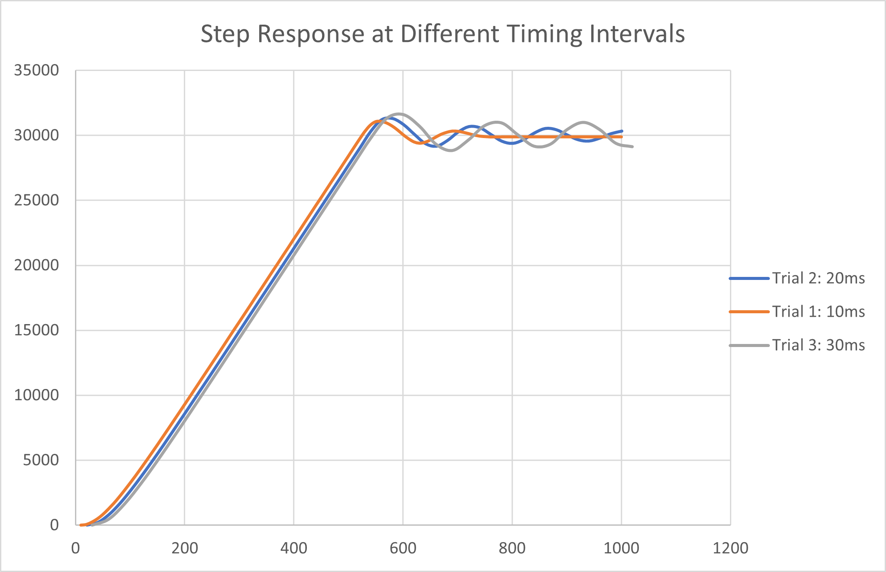

# ME405-Lab3
## Controller Frequency Plots

> In this experiment we used a scheduler to get our motor-controller tasks
> to run at certain timing intervals. We do this because the encoder and 
> controller tasks are higher priority than the motor and user-interface 
> tasks. 
> 
> Our two motor control system worked beautifully. We were able to get both
> motors to spin to different set points simultaneously and in less than 1
> second. 
> 
> To determine how fast or slow we can run our tasks we connected one motor 
> to a large flywheel, entered a desired setpoint, then plotted the encoder
> position against time for the step response. We had our original controller
> period at 10 ms as was suggested in the lab prior; to find how slow we could
> run our controller we increased the period in increments of 10 ms to 30 ms. 
>
> The step responses for the three timing periods can be seen above. 
> Unsurprisingly, the fastest period has the quickest settling time. As well,
> the oscillition around the set point increased as the task period increased.
> Because of the data we plotted from our step response, we recommend the
> motor control task run at least every 10 ms.
